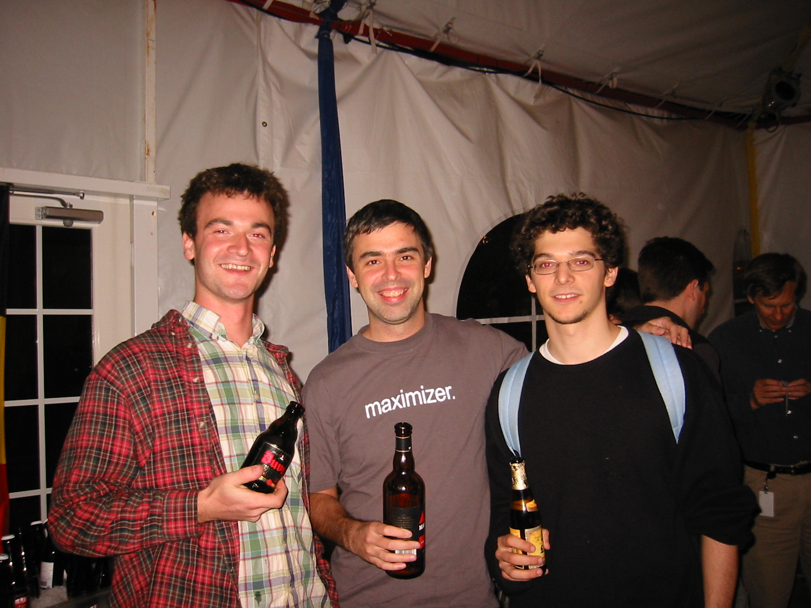

.. title: Chocolate mousse and algorithmic evolutions of my online profile
.. slug: chocolate-mousse-and-algorithmic-evolutions-of-my-online-profile
.. date: 2014-10-21 11:05:29 UTC+02:00
.. tags: google, massiveteaching, coursera, scholar14, baidu
.. link: 
.. description: 
.. type: text
.. author: Paul-Olivier Dehaye

In the context of `#scholar14 <https://twitter.com/search?f=realtime&q=%23scholar14&src=typd>`_, I would like to share my own experience fighting `algocracy <http://philosophicaldisquisitions.blogspot.ch/2014/01/rule-by-algorithm-big-data-and-threat.html>`_. This echoes a post of `Frances Bell <http://francesbell.wordpress.com/2014/10/21/starting-networked-scholarship-mooc-scholar14/>`_, who reflects on the lack of attention shown by Google to her since she lost her university affiliation.

.. raw:: html

    
   

.. raw:: html

    
   
I am not naive with respect to those algorithms: as a grad student at Stanford, I was in close contact between 2001 and 2006 with many engineers who built the main engines behind algocracy, and principally Google. In response, I did various "experiments" to test our new future. For instance, I intentionally put up a (decadent) chocolate mousse recipe on my homepage, and optimised its search rankings (through metadata and social engineering). The goal was to get it as a top result when Googling for *Chocolate Mousse*, and thereby acquire an objective claim to the best recipe. It worked (watch out, `blast from the past <https://web.archive.org/web/20051119033115/http://math.stanford.edu/~pdehaye/>`_!). It was also quite useful information to have to retain the attention of my undergraduate students at Stanford, who were learning about Google's algorithm in their linear algebra class! The recipe attracted 200.000 visitors over the years, around a hundred hits a day except for specific days where it hit around a thousand (quick game, which generates more hits? `Christmas 2005 <../christmas2005.png>`_, `Thanksgiving 2005 <../thanksgiving2005.png>`_ or ` Valentine Day 2006 <../valentine2006.png>`_?). At some point I also toyed with Google AdWords, trying to determine if that gave a boost to my rankings. In any case, this netted around $300 a year (impressive income if you scale this up to thousands for recipe sites). In a separate experiment with Google's algorithm, I tied `a fake picture <../DiederikMarius.jpg>`_ to the name of a friend, to see if I could affect his Google rankings. This backfired as searches on *either* of our names would show up that picture first. 

This is all fun and games, but it becomes less so when you start to track too closely the likely evolutions of the field. I do not want to actually figure out how easy it would be to map out wifi networks myself: better to let either `Google <http://www.telegraph.co.uk/technology/google/7786255/Google-has-mapped-every-WiFi-network-in-Britain.html>`_ or `Apple <http://www.zdnet.com/blog/networking/how-google-and-everyone-else-gets-wi-fi-location-data/1664>`_ break the laws themselves first, even though I suspected how they were doing it as they were doing it (first use cars, then use you). Likewise, It would be easy to play very elaborate pranks on friends via Facebook (much more creepy and/or elaborate than `here <http://mysocialsherpa.com/the-ultimate-retaliation-pranking-my-roommate-with-targeted-facebook-ads/>`_). I could also even attempt to use it to influence others in my own interest, say at work. But I don't do it: while it is likely legal, it is also immoral. 

As academia moves online, though, `it starts adopting new practices <http://www.educause.edu/ero/article/intentional-web-presence-10-seo-strategies-every-academic-needs-know>`_. This is great, but we are still lagging so much behind the commercial world, as all the online giants are flexing their muscles looking our way: `Google attempts to redefine the reach of universities <http://www.timeshighereducation.co.uk/news/the-20-most-searched-universities-in-the-world-on-google/2015972.article>`_, while `LinkedIn redefines the usefulness of the degrees they deliver <http://blog.linkedin.com/2014/10/01/ranking-universities-based-on-career-outcomes/>`_.

A big part of the MOOC companies' sales pitch is that they show high up when you Google for a course topic. Presumably wikipedia is a direct competitor for those rankings. They are tech companies, and this establishes their *reach*, which is a crucial factor in any university administrator's decision regarding MOOCs. In June 2014, I started `teaching a course on Coursera <https://www.coursera.org/course/massiveteaching>`_, and my own `Coursera profile <https://www.coursera.org/instructor/podehaye>`_ showed high up in my Google rankings. 

When the course experienced disruption, I was `censored and prevented from expressing myself regarding the reasons of this disruption <./short-statement-on-massiveteaching-part-i.html>`_. In contrast, Coursera was free to address the issue on its own terms. Through much innuendo or intentional misdirection, on their own site and in the press, Coursera managed to completely discredit me. This fed back into student conversations on the course forums (which were kept open for as long as was convenient), blogs maintained by fellow academics or even (at least one) keynote academic talk. Of course, all those hits shot right up when Googling my name, since they came from established institutions or individuals.

For a variety of reasons, the university would not let me use either my professional homepage or Twitter to address the core of the issues (or what people thought was core). All the wrong arguments were used to calm me down. Meanwhile, I could see all those online attacks on my reputation creep up in search rankings, and my social capital tank. I have never been in this situation before: as a professor, being prevented to argument your opinions feels utterly miserable. Ironically, I found solace in `Baidu-ing <http://www.baidu.com/>`_ myself (it seems there is a delay in their rankings, and they highlight completely different sites). This might all feel very egocentric, but at the time I was resolved I would need to find a job outside of academia. That would be hard to achieve with the online profile that had been built up for me...

    Because Coursera had exclusive control over just one channel, that between students and instructors, it managed to establish a narrative that differed entirely from the truth. 

I was left with few options. I tried to leverage online academic events to show that I was not hiding (for instance attending the `Berkman seminars <http://cyber.law.harvard.edu/>`_, via Twitter). I started backchannel conversations with my peers, and overt ones (but since I had to avoid the topic of the course itself, many of those got off the wrong foot). I `started my own blog <./naivete-and-the-barber-paradox.html>`_ ( well over a month after the disruption, once I obtained reassurances that this was allowed). 

By now, the situation in my Google ranking is as follows:

- my university homepage (built over years of work, transferring its Google clout through 301 redirects across countries several times. How will scholars of the future do that?);
- my Twitter account (comes with its own restrictions, but at least does not require a login to passively consumed);
- my Coursera profile (or rather a shadow profile that was created once my instructor rights were removed, and that I cannot edit);
- a blog post by George Siemens, that starts with congratulations but devolves into insults in the comments;
- my own blog;
- my LinkedIn profile;
- a post by Rolin Moe, that shows equally caring reflection to Siemens' but has not attracted any attention;
- my Math Overflow profile;
- an *Inside Higher Ed* article

Ultimately, I can write this now because I have been formally "reminded" of my own legal obligations: to the Kanton of Zurich. But I know that this means doing my job, and that this job comes with the liberty to say inconvenient truths. Here are a few: 

(Dedicated to all the scholars who have tanked a MOOC and not been allowed to express themselves as freely online as they would have offline. Please pass this on to them.)

