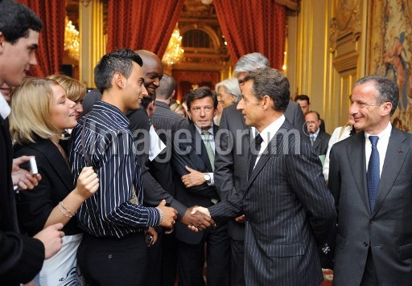

.. title: When Sarkozy met Coulibaly
.. slug: when-sarkozy-met-coulibaly
.. date: 2015-01-11 08:24:19 UTC+01:00
.. tags: 
.. link: 
.. description: 
.. type: text
.. author: Paul-Olivier Dehaye

.. raw:: html

    

.. raw:: html

    

The above is a picture of Nicolas Sarkozy, then French president, shaking hands with (most likely) Amedy Coulibaly, a terrorist who killed one policeman and four shoppers in a kosher supermarket in Paris early January 2015. 

This handshake took place on July 15 2009, at an official event at the Elysee palace, organised to promote apprenticeships for youth. 

.. TEASER_END: (Click to read about the sourcing of this picture and its relevance)

I am not 100% sure it is the same person. According to an article by `Le Parisien <http://www.leparisien.fr/grigny-91350/amedi-27-ans-rencontre-sarkozy-cet-apres-midi-15-07-2009-580211.php>`_, Coulibaly was due to go on that day to the Elysee Palace. Other journalists have assessed the truth of that statement, for instance `Ivan Valerio for Le Figaro  <http://www.lefigaro.fr/politique/le-scan/citations/2015/01/09/25002-20150109ARTFIG00228-en-2009-amedy-coulibaly-le-tireur-de-montrouge-etait-recu-a-l-elysee.php>`_ and `Cyril Morin for Le Lab Europe 1 <lelab.europe1.fr/Quand-Amedy-Coulibaly-suspect-presume-de-la-tuerie-de-Montrouge-etait-recu-a-l-Elysee-20124>`_. 

For `BFMTV <http://www.bfmtv.com/societe/quand-le-parisien-s-interroge-sur-une-rencontre-entre-coulibaly-et-sarkozy-856642.html>`_, collaborators of Sarkozy are downplaying the significance of this: 

   L'entourage de Nicolas Sarkozy, contacté par l'AFP, a dit "ne pas pouvoir confirmer qu'il s'agit de la même personne". "Le 15 juillet 2009, au palais de l'Élysée, il a reçu des dirigeants de grandes entreprises engagées en faveur de l'emploi des jeunes et ces entreprises sont venues avec 500 jeunes en formation en alternance chez eux", a-t-on rappelé.	 "A aucun moment, il n'y a eu de rencontre personnelle" entre Nicolas Sarkozy et la personne évoquée par l'article, a-t-on aussi assuré.

Ten months later, police searched his apartment and found 240 rounds of 7.62mm rifle ammunition.

**Sourcing of the picture**

Once I learned of the possible encounter, I looked for pictures of the event in press pools. The AFP had one, `here <http://www.imageforum-diffusion.afp.com/>`_ (search 2009-07-15 and "Sarkozy"). It was taken by Eric Feferberg. 

Judging from the Liberation article, other photographers were there, for instance Giancarlo Gorassini for ABACA press. Unfortunately I do not have the (journalistic) credentials to check their online archives. 

I sourced this picture a few days ago already, and posted it on Twitter. Since, it has started circulating, mostly on Russian websites tied to conspiracy theories, and on the `Twitter account of Marco Bresolin <http://twitter.com/marcobreso/status/553580502444421120>`_. It was also shared by an Italian journalist (who picked it up 40 minutes after I did, presumably from my Twitter account), and shared onwards to at least one French far-right account.
