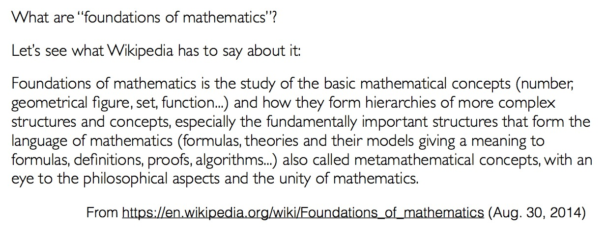
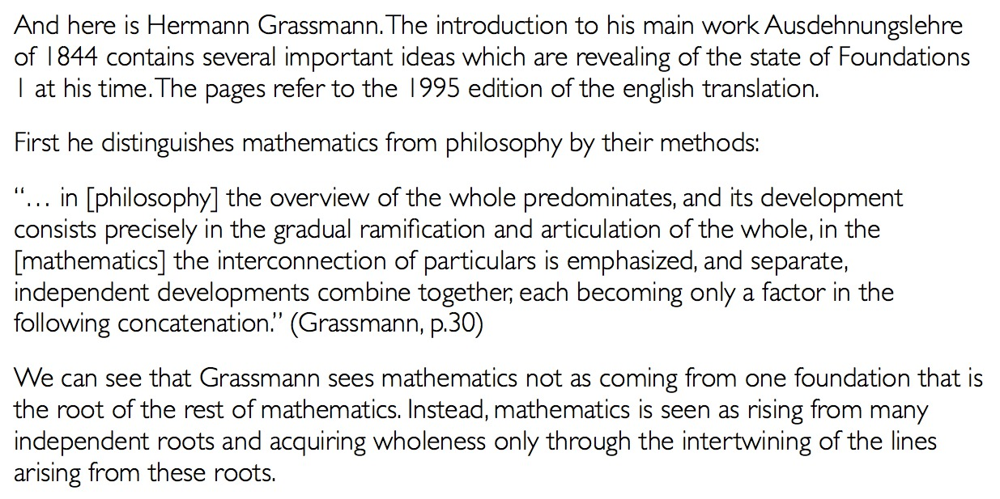

.. title: Foundations of mathematics
.. slug: paul-bernays-lectures-at-eth-zurich
.. date: 2014-09-13 21:44:20 UTC+02:00
.. tags: rhizo14, mathematics, foundations
.. link: 
.. description: 
.. type: text
.. author: Paul-Olivier Dehaye

.. image:: ../bernays.jpg
   :align: right
   :scale: 50%

The ETH Zurich hosts every year the `Paul Bernays lectures <http://www.gess.ethz.ch/news/pbl>`_. This the type of lecture where people expect a Nobel prize winner to show up. Well, unless it is a mathematics one (the topic rotates among a few sciences), in which case it is OK if the speaker only has a `Fields medal <http://en.wikipedia.org/wiki/Fields_Medal>`_. 

This year, it was the latter. The speaker was `Vladimir Voevodsky <http://en.wikipedia.org/wiki/Vladimir_Voevodsky>`_ from the `Institute for Advanced Study <http://en.wikipedia.org/wiki/Institute_for_Advanced_Study>`_ in Princeton (the same institute where Einstein and many other brilliant scientists were coopted following great successes).

Voevodsky's initial success was in proving the `Milnor conjecture <http://en.wikipedia.org/wiki/Milnor_conjecture>`_, but he hasn't stopped there. He has announced a proof of the Bloch-Kato conjecture as well, and is now working on Homotopy Type Theory. 

This theory is tied to the foundations of mathematics. To the layman, it really asks deep questions about what mathematics is, and how mathematics is constructed and improved, both by computers and humans. In some ways, he is trying to scientifically map out mathematics, and during the talk suggested a 500 year horizon to do that (part of many bombastic and exciting claims made by very smart mathematicians, such as Thomas Hales at the `end of his lecture here <http://www.youtube.com/watch?v=DJx8bFQbHsA>`_, who are willing to challenge the statu quo). Of course, one needs to start "small", and this is what Voevodsky explained in Zurich, his vision of the *Foundations of Mathematics*.

For this he had three times one hour, which he sensibly divided into: `past <https://github.com/vladimirias/2014_Paul_Bernays_Lectures/blob/master/2014_09_Bernays_1%20presentation.pdf?raw=true>`_, `present <https://github.com/vladimirias/2014_Paul_Bernays_Lectures/blob/master/2014_09_Bernays_2%20presentation.pdf?raw=true>`_, and `future <https://github.com/vladimirias/2014_Paul_Bernays_Lectures/blob/master/2014_09_Bernays_3%20presentation.pdf?raw=true>`_.

I want to focus here on the "past" talk. He started it by quoting wikipedia's definition of *Foundations of Mathematics*:

   
and highlighted that there were two parts to this definition: the *mathematical concepts* and the *metamathematical concepts* (the *structures that form the language*). He then went on to explain the presence of this dichotomy through the ages: discrete vs. continuous, pure vs. applied,  theorem vs. problem (*an inquiry the 
answer to which is a construction of an object*), and eventually touched on this account of what mathematics is: 

Voevodsky's interpretation of what Grassmann is saying is thus: **mathematics is seen as rising from many independent roots and acquiring wholeness only through the intertwining of the lines arising from these roots**.