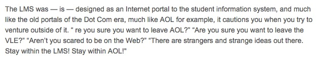

.. title: Security theater, for flying and higher education
.. slug: security-theater-for-flying-and-higher-education
.. date: 2014-09-25 02:25:19 UTC+02:00
.. tags: mooc, security_theater, evgenymorozov, audreywatters, finkd, aral, gsiemens, why
.. link: 
.. description: 
.. type: text
.. author: Paul-Olivier Dehaye

When I was in Oxford, I had the best view in the world from my apartment. Off Merton Field, above Deadman's Walk onto `Christ Church Meadow <http://en.wikipedia.org/wiki/Christ_Church_Meadow,_Oxford>`_. Uninterrupted grass landscape into the river, with rolling mist up to the river most mornings, "Lord of the Rings"-style. In fact, Tolkien's office was actually the apartment upstairs, and I like to think that it inspured him. How come, in a cramped city like this, I could enjoy this same view decades later, centuries after the construction of the building I was living in? Well, because in the byzantine world of Oxford real estate, one college (ChristChurch) owned that land, while another owned grazing rights for cattle on it (forgot which, presumably Merton itself). Not that tourists would see cattle in that field: every year, the college with grazing rights would rent sheep for just one day, and move it there. The theory was that if they didn't exercise their right, they would legally lose it, and the other college could build whatever they wanted there and ruin the view (Wikipedia mentions a road that was defeated). The pace at Oxford allowed to think this through: custom is built over centuries, and preserved with yearly activities.

Why this long preamble? 

I was just in Goteborg for the #Chals14 conference, where a big part of `my schpiel was that we should not succumb to the free-is-a-lie mantra of MOOCs <moocs-as-inventions-chals14.html>`_ and resist narrow views of the "Internet happening to education" (quoting George Siemens) based around technological determinism (quoting Evgeny Morozov). The afternoon session was in Swedish, so I was distracted and looking at Twitter. One person that I am following, Aral Balkan, tweeted this:

.. raw:: html

   

   <blockquote class="twitter-tweet" lang="en">
Is <a href="https://twitter.com/Schiphol">@schiphol</a> airport breaking EU law? They told me today that I could not opt of the full-body scanner.&#10;&#10;<a href="http://t.co/LfQ7k20ZLG">http://t.co/LfQ7k20ZLG</a>&#10;&#10;Via <a href="https://twitter.com/alloy">@alloy</a>
&mdash; Aral Balkan (@aral) <a href="https://twitter.com/aral/status/514736935978680320">September 24, 2014</a></blockquote>
   
   

Balkan is a privacy advocate, who has been trying to raise the attention of people to the `Spyware 2.0 model <https://aralbalkan.com/notes/spyware-2.0/>`_ employed by many companies now: in his Orwellian view, by offering free services, large corporations manage to convince us to give away all our data, so they can spy on us. He is involved in the `Indieweb <https://twitter.com/hashtag/Indieweb?src=hash&mode=news>`_ and peripherially (?) in the `Reclaim the Web movement <http://dmlcentral.net/blog/doug-belshaw/reclaiming-web-next-generation>`_, which also has declinations in the MOOC space (for instance with `Known <http://www.wired.com/2014/09/known/>`_). His tweet got me pretty upset: a few years ago, Schiphol security classified a present from my mom, high quality Belgian chocolate paste, as a liquid. Back then I had checked, and legally they were, at least at the time, within their rights: individual employees have ultimate classification decision and chocolate paste is indeed a grey area. Still, because of an arbitrary decision by a person who gleefully threw away a present in the bin, I was forced to make-do with Swiss chocolate for a while, a clearly inferior proposition. If you want to dismiss my reasons to do this, you could say that I have a score to settle with Schiphol security. 

.. image:: ../schiphol-hand.jpg
   :align: right
   :scale: 50%

As luck would have it, on my flight back to Zurich from Goteborg, I was flying through Schiphol. On the very same day. On top, the `twitter thread <https://twitter.com/aral/status/514736935978680320>`_ had a ton of links to the relevant laws and websites, which were completely unambiguous. So all the work of retesting this more "scientifically" was cut out for me. In fact, one could argue that as an academic this is part of my work: to challenge institutions, spread knowledge, and contribute to society. These last two points made by many #Chals14 participants in the context of MOOCs. I agree and generally take it seriously, especially living in a country where academic freedom is in the constitution, where I am paid well to think, connect dots, etc. My view of academia might smack of arrogance and overreach, but bear with me. 

A few hours later, I myself landed in Schiphol, and got out of the transit area so I would have to intetionally get back through security. Since I could not print it on time, I had written on my hand the references to European regulation, 185/2010 4.1.1.10, a `Dutch website URL <http://www.nctv.nl>`_ and my plan: 

- refuse body scanner twice; 
- ask for an explanation of my rights; 
- question the legality of their setup;
- ask for the name of the person I was talking to;
- ask to speak to a supervisor;
- iterate. 

When I approached the security scanner, I looked around. Nowhere was it written that I could opt out. It was simply written that I should "feel free to ask questions". In Balkan's case, this was not helpful at all: since the security employee seems to have violated the law, Balkan couldn't just point to a sign and say he was wrong. The fact that there was no sign is, according to me, already a violation of European law:

.. image:: ../EUlaw-schiphol.jpg
   :scale: 100%
   :align: center

When I had to finally talk to a Schiphol security officer and refuse the scanner, our interaction validated all the care I put in preparing this (and my general approach to a few similar challenge-the-authority projects I am involved in): his reaction was simply to ask me "Why?", why I was refusing. If there is one thing I learned this summer, it is to ask myself "Why?" and have a good answer to this question. In this case, I could definitely answer it right away: "Because this is my right". By keeping a pretense of being citizen beta, I got the officer to volunteer the reason why he himself asked me "Why?": he volunteered "because sometimes people don't have the right information and think those are X-rays machines going through their skin" (regardless of the validity of the assertion, this is irrelevant to the fact that European law still allows me to opt out). I repeated that I was still refusing, and he then let me get around the scanner and started patting me down. 

To emphasize: this particular officer knew from the start that I had the option of opting out. While being perfectly courteous, he was making assumptions of my own ignorance, expecting to enlighten me with information about his very expensive, super advanced, and ultimately useless piece of technology [1]_.  This explanation was supposed to somehow impress me, and lead me to willingly give away my own rights as a EU citizen (on EU soil, which I know is relevant, living in Switzerland). Given that I had gone to Goteborg to partly talk about technological determinism, with quotes of Zuckerberg on the evolving nature of privacy (including the "dumb fucks" quote, page 11 of `my slides <../goteborg-final.pdf>`_), this was adding another layer of irony... There possibly was arrongance in my assumptions about my role as an academic, but certainly there were in the assumptions the officer was making: he didn't know about the Oxford sheep (presumably), all the necessary tabs opened and ready on my laptop, the writing on my hand, or the fact that I have quite a bit of experience with EU law (in the context of a separate private matter, I have previously encouraged the European Commission to initiate an `infringement procedure <http://ec.europa.eu/eu_law/your_rights/your_rights_en.htm>`_ against my home country, Belgium, through a *highly*  recommended and free legal venue, available to any European citizen and maybe resident).

Once he had patted me down, and I had effectively gone through security, it was time to lay some of it out. Of course, I was quickly bounced around to the shift supervisor (who looked quite a bit senior), René M. He was genuinely concerned and wanted to do the right thing: he took my card, took pictures of my screen to get the relevant EU law lines and the original tweets. I told him to look for the #HelloSchiphol hashtag on Twitter. 

But again he dismissed Balkan as just a tweeter among others, and I had to insist that he actually had many followers who care about privacy, that he is taking on Google, etc. I shouldn't have had to do that, and neither should it have mattered that I am a university professor, yet he did remark on the fact [2]_. One can argue about my method and its transparency, but by playing dumb I actually got further than just flashing legal printouts right away, since I now have one more data on how Schiphol security officers approach unprepared citizens concerned with airport security. 

Overall, this experience with Schiphol security was very positive, and I don't have a grudge against them anymore (provided they add relevant signage). 

Now I want to contrast this with another security theater incident [3]_, this time in the MOOC space. This incident reminds me of parts of a `talk by Audrey Watters <http://hackeducation.com/2014/09/05/beyond-the-lms-newcastle-university/>`_ about the LMS:

 discussing Coursera's response to the recent "hack" of Coursera by Jonathan Mayer. Mayer is a lawyer, but also a PhD student at Stanford in computer science. So far his research has cost Google 22.5M USD in fines, and earned him the distinction of being `labeled by the online advertising trade union <>`_ a "Bolshevik of the Internet".  He is 26. He is teaching a `course on Surveillance Law <>`_ on Coursera (how the NSA, FBI, etc are spying on everyone), possibly the youngest instructor there. A week before his course, he published a blog post detailing some security flaws of Coursera itself. 

Since this was a European law, and I have successful personal experience of suing my home country through the European Commission at no cost, on a completely unrelated private matter, I felt that this 

It was thrown away my high quality Belgian chocolate paste lovingly offered by my mom as a liquid, and summarily and very rudely threw it away in the bin (with a devilish smile), forcing me to eat the Swiss version instead for a while. I looked up my rights, and at the time  You could say I have a personal vendetta against Schiphol security.

http://hackeducation.com/2014/09/05/beyond-the-lms-newcastle-university/

#HelloSchiphol

groupthink   Salaita 

Schreier 
Morozov
Balkan
Belshaw
Siemens
Rene M. 
Watters

grateful

In case it is not clear at this stage, I still have a score to settle against Coursera, and I am a patient man. 

.. [1] I claim this general technology is useless based on still unpublished research `announced last month <http://www.wired.com/2014/08/study-shows-how-easily-weapons-can-be-smuggled-past-tsas-x-ray-body-scanners>`_. I was unprepared to enter that debate there with the security officer, not knowing exactly which model Schiphol was using. I suspect the officer was not ready either. The point is that we shouldn't have to, as this particular European law was drafted anticipating rapid evolution in this security field, both regarding threat detection and evasion. 

.. [2] He only learned that at the very end, when I wrote #HelloSchiphol on my business card. There is, so far in my life, only one (repeated) instance where I have flashed the fact that I am a professor: apartment hunting in Switzerland, for which competition is so fierce that local society admits pretty much *any* move is fair. 

.. [3] To use the language of Bruce Schneier. 