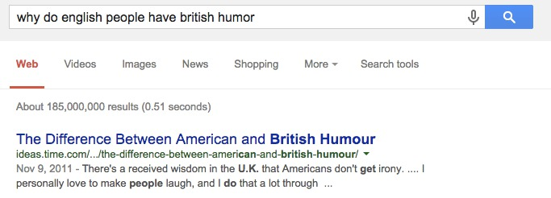

.. title: The academic (social) machine
.. slug: the-academic-social-machine
.. date: 2014-09-11 13:40:33 UTC+02:00
.. tags: social_machine, google, algorithmic_bias
.. link: 
.. description: 
.. type: text
.. author: Paul-Olivier Dehaye

There was recently a `picture circulating on Twitter <https://twitter.com/AndrewBRElliott/status/507912025599934464/photo/1>`_, like pictures do.

.. image:: ../why_google.jpg
   :scale: 60%
   :align: center

.. raw:: html
   
    

This is, to say the least, a skewed view of academia, although I am certainly not the best placed to say that. I tend to have a beard, use big words, have recently started blogging and did `wear robes at some point in my academic career <http://en.wikipedia.org/wiki/Academic_dress_of_the_University_of_Oxford>`_. This is however a good opportunity to show how algorithmic bias works. 

First off, where does the bias originate here? 
As I explained before in my post on `social teaching machines <../posts/social-teaching-machines.html>`_, autocompletion surfaces information collected previously. The information in this case is collected in various ways, most notably by looking at previous searches. It is difficult to make broad statements on why people make a Google search. It's an act that always occurs in a certain context, a ton of different reasons, and Google optimises for an average that is unclear. Who else is making the same search will undoubtedly have an effect on how it sees the context of a search. Indeed, consider the `search  <https://www.google.ch/?gfe_rd=cr&ei=uvERVIGPKKbC8gfCuIGQAg&gws_rd=ssl#q=why+do+english+people+have+british+humor>`_ *Why do English people have British humor?* That search feels a bit odd, but the first answer suggests that indeed lots of Americans are bound to wonder about that.

.. raw:: html
   
    

.. raw:: html
   
    

I am a bit at a loss to say more on this, so feel free to comment.

In any cases, some of those biases are substantially more serious, of course. For this, you simply have to enter a search of the form "Why do **A** people **B**", where **A** can be any of {*asian*, *white*, *black*} and **B** any of {*look*, *like* *smell*} to realise that autocomplete is powerful to surface common stereotypes. Not all those autocompletes work though (presumably because the output is too vile and has been hand blocked). So we humans enter our biases, and Google actually amplifies them. 

Let's see where this leads. 

In the case of autocompletion, the impact is certainly weak, but it might correlate with other biases (or cause them?), underscoring a more ingrained problem. Let's go back to Google's view of academia: what does the output of a Google Image Search of *academics faculty* return?  You can try to use this `link <https://www.google.com/search?site=&tbm=isch&source=hp&biw=1366&bih=635&q=academics+faculty&oq=academics+faculty>`_, which is user agnostic (but its output will be personalized by Google once you click, unless you use privacy conscious tools). Here is the view I get, when logged in:

.. image:: ../why_google_images.jpg
   :scale: 100%
   :align: center

.. raw:: html
   
    

Yours should be different: most probably, Terence Tao, the short-sleeved mathematician in the middle row is further down in yours. This is reasonable, and explained by `Christian Sandvig <http://www-personal.umich.edu/~csandvig/>`_ in a beautiful post called `Show-and-Tell: Algorithmic Culture <http://socialmediacollective.org/2014/03/25/show-and-tell-algorithmic-culture/>`_: since I am a mathematician, Google gives Tao a bump [1]_. And beyond that? Well, Google *really* thinks that academics wear robes half the time, and perpetuates this bias also visually, not just in autocomplete. One consequence is that when humans need to illustrate something (a blog, an educational resource,...) it actually requires effort, judgement not to succumb to that bias. For robes it is of course very easy. For skin color or diversity, as we know, it can be harder and thus requires training and conscious effort, since what you see out of Google is *potentially* already biased. I say here *potentially*, since no one exterior to Google knows (or even most likely no one inside Google has a full understanding of the algorithms used). 

Services like `Sketch2Photo <http://www.ece.nus.edu.sg/stfpage/eletp/Projects/Sketch2Photo/>`_ 

.. [1] This effect, of showing me Tao higher than average, might be reasonable in this case, but it could also lead to some form of `filter bubble <http://en.wikipedia.org/wiki/Filter_bubble>`_ if there were (many) more mathematicians, and other unforeseen consequences as tested by the `recent Facebook experiment <http://www.forbes.com/sites/dailymuse/2014/08/04/the-facebook-experiment-what-it-means-for-you/>`_. 
